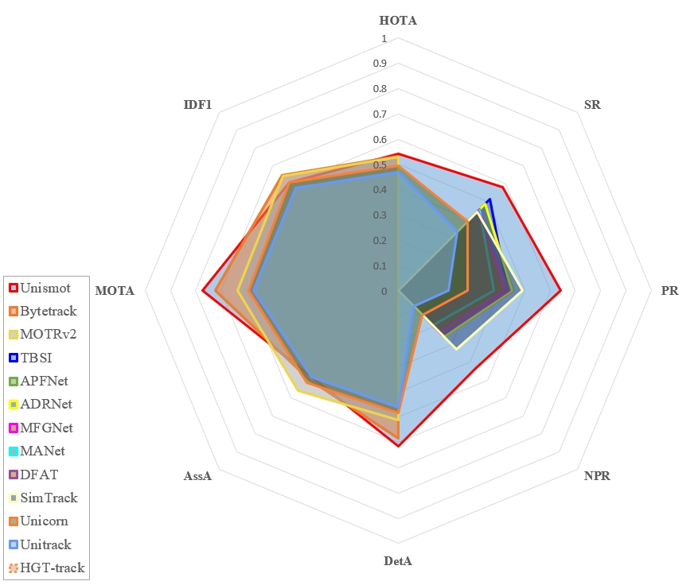
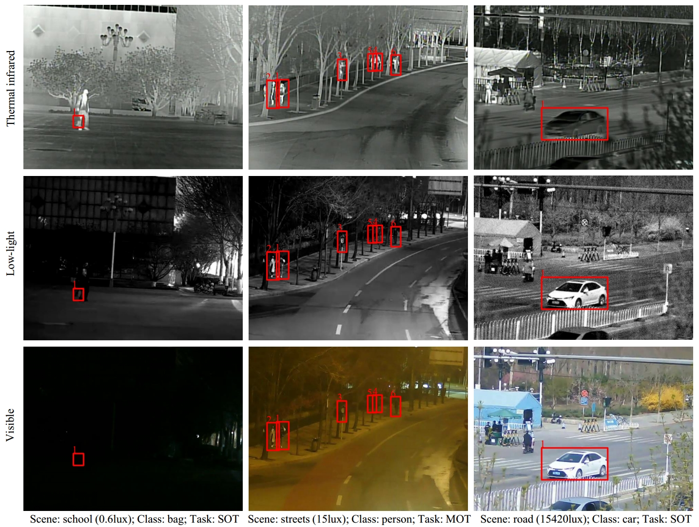

# Unismot

### A Unified Baseline Tracker for Multimodal Single and Multiple Object Tracking

<p align="center">
  
</p>

> [**UniRTL: A Universal RGBT and Low-Light Benchmark for Object Tracking**](https://www.sciencedirect.com/science/article/abs/pii/S0031320324007350)    
> Lian Zhang, Lingxue Wang, Yuzhen Wu, Mingkun Chen, Dezhi Zheng, Liangcai Cao, Bangze Zeng, and Yi Cai    
> *[Pattern Recognition: 110984](https://www.sciencedirect.com/science/article/abs/pii/S0031320324007350)*

## Abstract

Single and multiple object tracking in RGBT (RGB and Thermal) and low-light conditions pose significant challenges due to varying illumination and modality differences. **Unismot** introduces a **Universal RGBT and Low-light Benchmark (UniRTL)**, comprising 3 × 626 videos for SOT and 3 × 50 videos for MOT, totaling over 158K frame triplets. The dataset is categorized into low, medium, and high illuminance based on scene illuminance measurements. We propose a unified tracking-with-detection framework that integrates a detector, first-frame target prior (FTP), and data associator, effectively addressing both SOT and MOT tasks. Enhancements such as a ReID long-term matching module and the reuse of low-score bounding boxes further improve tracking performance. Extensive experiments demonstrate that **Unismot** outperforms existing methods on established RGBT tracking datasets, promoting robust multimodal tracking across varying lighting conditions.  

<p align="center">
  
</p>

## 🚀 News

- **October 2024**: Dataset and code are now open-source!
- **September 2024**: Paper accepted by *Pattern Recognition*!

## 🏆 Tracking Performance

### Results on UniRTL SOT and MOT Test Sets

| Dataset | Feature Extractor | NPR   | PR    | SR    | HOTA | DetA | AssA | MOTA | IDF1 |
|---------|--------------------|-------|-------|-------|------|------|------|------|------|
| UniRTL  | RGB+T+Low-light    | 0.461 | 0.676 | 0.607 | 56.6 | 62.2 | 51.7 | 69.3 | 62.9 |

## 📦 Installation

### 📝 Prerequisites

- **Operating System**: Ubuntu 20.04
- **Python**: 3.8.20
- **PyTorch**: 1.9.1

### 1. Clone the Repository and Submodules

```bash
git clone --recursive https://github.com/Liamzh0331/Unismot.git
cd Unismot
```

*If you cloned without `--recursive`, initialize submodules:*

```bash
git submodule update --init --recursive
```

### 2. Install System Dependencies

Ensure the following OpenGL-related packages are installed:

```bash
sudo apt update
sudo apt install -y libgl1-mesa-dri libglu1-mesa libgl1-mesa-glx
```

### 3. Set Up Python Environment (Optionally)

It's recommended to use Conda or a virtual environment.

**Using Conda:**

```bash
conda create -n unismot python=3.8
conda activate unismot
```

**Using Python Virtual Environment:**

```bash
python -m venv unismot_env
source unismot_env/bin/activate
```

### 4. Install Python Dependencies

Due to known issues with some packages, install `numpy` and `lap` with specific `pip` first:

```bash
pip install --upgrade pip==22.0.3
pip install numpy==1.24.4
pip install lap==0.4.0
```

Then, install the remaining dependencies:

```bash
pip install -r requirements.txt
```

### 5. Install Unismot

```bash
python setup.py develop
```

### 6. Verify the Installation

Open a Python REPL and run:

```python
import unismot.core
import unismot.data.datasets
```

Ensure no errors are raised. For additional verification, you can run:

```bash
python -c "import unismot; print('Unismot installed successfully!')"
```

## 🗄️ Data Preparation

### 1. Download the Dataset

Download the **UniRTL** dataset from the following links:

- **Baidu Pan:** [UniRTL Dataset (code: liam)](https://pan.baidu.com/s/1WcJAMPAb2UZ9b2qGygzCAw?pwd=liam)
- **Google Drive:** [UniRTL Dataset](https://drive.google.com/file/d/1HzVhs21DATq9LqSjVZI9ltxiOdCxcivB/view?usp=sharing)

### 2. Organize the Dataset

Extract the dataset and place it under `<Unismot_HOME>/datasets` with the following structure:  

```
datasets/
└── UniRTL/
    ├── MOT/
    │   ├── train/
    │   ├── test/
    │   ├── test_high_seqmap.txt
    │   ├── test_low_seqmap.txt
    │   ├── test_med_seqmap.txt
    │   ├── test_seqmap.txt
    │   └── train_seqmap.txt
    └── SOT/
        ├── train/
        ├── test/
        └── eval/
```

### 3. Convert Datasets to COCO Format

Navigate to the project root and execute the following scripts:  

```bash
cd <Unismot_HOME>
python tools/convert_sot_to_coco.py
python tools/convert_mot_to_coco.py
```

### 4. Mix Different Training Data

Follow the steps in `mix_data_UniRTL.py` to create a data folder and establish necessary links. Then, execute:

```bash
cd <Unismot_HOME>
python tools/mix_data_UniRTL.py
```

## 🏭 Model Zoo

### Pretrained Models

Pretrained models trained on half of the UniRTL training set and evaluated on the UniRTL test set are available for download:

- **Baidu Pan:** [Pretrained Models (code: liam)](https://pan.baidu.com/s/1fBiFya4bUUTqm6-D0rYykA?pwd=liam)
- **Google Drive:** [Pretrained Models](https://drive.google.com/file/d/1KcPOrML6lNvglUXi9ghTOZe6CG2aqciS/view?usp=drive_link)

### **Available Models**

| Model              | SR    | HOTA |
|--------------------|-------|------|
| unismot_l_RGBTL2   | 0.607 | 56.6 |
| unismot_x_RGBT     | 0.582 | 54.2 |
| unismot_l_RGBT     | 0.582 | 54.1 |
| unismot_m_RGBT     | 0.613 | 52.9 |
| unismot_s_RGBT     | 0.532 | 50.6 |
| unismot_tiny_RGBT  | 0.546 | 50.3 |
| unismot_nano_RGBT  | 0.525 | 46.1 |

## 🎓 Training

After downloading the pretrained models, place them in the `<Unismot_HOME>/pretrained` directory.

### 1. Train SOT and MOT Models for RGBT-L² Tracking

```bash
cd <Unismot_HOME>
python tools/train.py -f exps/example/mot/unismot_l_RGBTL2.py -d 2 -b 10 --fp16 -o -c pretrained/unismot_l_RGBTL2.pth.tar --nlow
```

### 2. Train SOT and MOT Models for RGBT Tracking

```bash
cd <Unismot_HOME>
python tools/train.py -f exps/example/mot/unismot_l_RGBT.py -d 2 -b 10 --fp16 -o -c pretrained/unismot_l_RGBT.pth.tar
```

## 🎥 Tracking

### 1. Tracking on UniRTL

#### Run UnismotTrack for Demo

Run the Unismot tracker for a demonstration:

```bash
cd <Unismot_HOME>
python tools/demo_track.py -f exps/example/mot/unismot_l_RGBTL2.py -c pretrained/unismot_l_RGBTL2.pth.tar --nlow
```

#### Run UnismotTrack for Testing

- **Single Object Tracking (SOT):**

  ```bash
  cd <Unismot_HOME>
  python tools/run_tracker.py -f exps/example/mot/unismot_l_RGBTL2.py -c pretrained/unismot_l_RGBTL2.pth.tar -pt ./datasets/UniRTL/SOT/train -tm SOT --nlow
  ```

- **Multiple Object Tracking (MOT):**

  ```bash
  cd <Unismot_HOME>
  python tools/run_tracker.py -f exps/example/mot/unismot_l_RGBTL2.py -c pretrained/unismot_l_RGBTL2.pth.tar -pt ./datasets/UniRTL/MOT/train -tm MOT --nlow
  ```

### 2. Evaluation on UniRTL

Download evaluation tools:

- **SOT Evaluation Toolkit:** [UniRTL Evaluation Toolkit (Baidu Pan)](https://pan.baidu.com/s/1_YQn9bO7UFNGjdrWWWHmzw?pwd=liam) | [(Google Drive)](https://drive.google.com/file/d/11mIg7WSITaJZfytmkrwxOZ28mmZyH4dU/view?usp=sharing)
- **MOT Evaluation Tools:** [TrackEval (Baidu Pan)](https://pan.baidu.com/s/1HtVB1-knH03Oyg1C24sJkg?pwd=liam) | [(Google Drive)](https://drive.google.com/file/d/1-fSvYEsoMzimAneF0hrtjcesbj19tI0w/view?usp=sharing)

Follow the instructions provided with each toolkit to evaluate tracking results.

## 📄 Citation

If you use Unismot or UniRTL in your research, please consider citing the following paper:

```bibtex
@article{ZHANG2025110984,
  title = {UniRTL: A universal RGBT and low-light benchmark for object tracking},
  journal = {Pattern Recognition},
  volume = {158},
  pages = {110984},
  year = {2025},
  issn = {0031-3203},
  author = {Lian Zhang and Lingxue Wang and Yuzhen Wu and Mingkun Chen and Dezhi Zheng and Liangcai Cao and Bangze Zeng and Yi Cai}
}
```

## 🤝 Contributing

Contributions are welcome! Please follow these steps to contribute:

1. **Fork the Repository**

2. **Create a Feature Branch**

   ```bash
   git checkout -b feature/YourFeature
   ```

3. **Commit Your Changes**

   ```bash
   git commit -m "Add Your Feature"
   ```

4. **Push to the Branch**

   ```bash
   git push origin feature/YourFeature
   ```

5. **Open a Pull Request**

Please ensure your code follows the project's coding standards and includes relevant tests.

## 🙏 Acknowledgements

This project builds upon the excellent work of:

- **[YOLOX](https://github.com/Megvii-BaseDetection/YOLOX)**: Base detection framework.
- **[ByteTrack](https://github.com/ifzhang/ByteTrack)**: Advanced tracking methods.
- **[RGBT Benchmark](https://github.com/mmic-lcl/Datasets-and-benchmark-code)** and **[MOT16](https://motchallenge.net/data/MOT16/)**: Dataset references.

Many thanks to the authors and contributors of these projects for their outstanding work. We appreciate the open-source community for their continuous support and contributions.

## 📜 License

This project is licensed under the [MIT License](LICENSE).

## 📫 Contact

For any questions or support, please open an [issue](https://github.com/Liamzh0331/Unismot/issues) or contact the maintainer:

- **Lian Zhang**: [liamzh0331[AT]gmail.com](mailto:liamzh0331@gmail.com)
